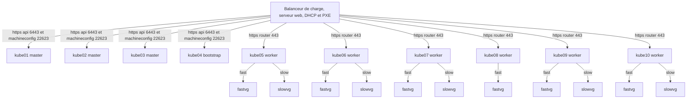

# Installation OKD sur BareMetal

On utilise Fedora CoreOS comme système d'exploitation pour installer OKD sur des machines physiques.

Pour déployer un cluster a trois noeuds master on a besoin de 4 machines. On peut ajouter le nombre de worker qu'on veut par la suite. Le cluster KUBELACAVE en contient 6.

    kube01: master0
    kube02: master1
    kube03: master2
    kube04: bootstrap
    kube05: worker0
    kube06: worker1
    kube07: worker2
    kube08: worker3
    kube09: worker4
    kube10: worker5

La machine bootstrap est temporaire, c'est celle qui va déployer le cluster sur les autres noeuds.

Voici les infpormations pour ce cluster:

    Zone DNS pour le cluster: kube.lacave.info
    Nom du cluster: kubelacave

## Infrastructure

Pour accueillir le cluster on a besoin des élments suivants:

    Un réseau local qui relie les machines du cluster dans le même sous-réseau.
    Un serveur PXE qui servira a démarrer les noeuds
    Un load balancer HTTP qui permet de distribuer la charge dans les différents noeuds. Que ce soit pour l'accès à l'API ou pour l'accès aux applications dans le cluster par les ingress.

Voici un schéma de l'infrastructure LACAVE.

## PXE Boot
Avec OKD, il est suggéré de provisionner les hôtes en utilisant pxelinux au lieu de l'image ISO. Cette section décrit comment le faire avec isc-dhcp-server, tftpd-hpa et pxelinux sous Ubuntu 22.04.

Pour ce document, on utilise les adresses MAC suivant. Les ajuster en fonction des adresses MAC de vos machines:

    kube01: AA-AA-AA-AA-AA-AA
    kube02: AA-AA-AA-AA-AA-AB
    kube03: AA-AA-AA-AA-AA-AC
    
### DHCP
Pour utiliser pxelinux afin de provisionner les machines physiques (et/ou virtuelles) du custer on doit avoir un serveur dhcp. Dans ce projet on utilise isc-dhcp server sous Ubuntu 20.04.

Installer le logiciel:

    sudo apt install isc-dhcp-server
    sudo systemctl enable isc-dhcp-server
    sudo systemctl start isc-dhcp-server

Pour PXE, on doit ajouter les lignes dans le fichier /etc/dhcp/dhcpd.conf
Référence: https://wiki.syslinux.org/wiki/index.php?title=PXELINUX

Paramètres généraux

    allow booting;
    option space pxelinux;
    option pxelinux.magic      code 208 = string;
    option pxelinux.configfile code 209 = text;
    option pxelinux.pathprefix code 210 = text;
    option pxelinux.reboottime code 211 = unsigned integer 32;

Section pour le sous-réseau. La seule ligne ajoutée pour le pxe dans cette section est option bootfile-name

subnet 192.168.1.0 netmask 255.255.255.0 {
  range 192.168.1.100 192.168.1.200;
  option domain-name "lacave";
  option domain-name-servers 192.168.1.10;
  option routers 192.168.1.1;
  default-lease-time 600;
  max-lease-time 7200;
  option bootfile-name "/pxelinux.0";
  site-option-space "pxelinux";
  option pxelinux.magic f1:00:74:7e;
  if exists dhcp-parameter-request-list {
    # Always send the PXELINUX options (specified in hexadecimal)
    option dhcp-parameter-request-list = concat(option dhcp-parameter-request-list,d0,d1,d2,d3);
  }
  option pxelinux.configfile = concat("pxelinux.cfg/", binary-to-ascii(16, 8, ":", hardware));
  option pxelinux.reboottime 30;
}

Redémarrer le service dhcp

    systemctl restart isc-dhcp-server
    systemctl status isc-dhcp-server

En cas de problème de configuration, les messages d'erreurs se retrouvent dans le fichier /var/log/syslog

Installer tftpd

    sudo apt install pxelinux
    sudo systemctl start tftpd-hpa
    sudo systemctl enable tftpd-hpa

Télécharger les fichiers nécessaire au démarrage d'un noyeaux permettant l'installation pour FCOS

    docker pull quay.io/coreos/coreos-installer:release
    sudo docker run --privileged -ti --rm -v /srv/tftp:/data -w /data quay.io/coreos/coreos-installer:release download -f pxe

Copier les fichiers nécessaires dans le répertoire du serveur tftp (pour Ubuntu /srv/tftp)

Fichiers FCOS

    sudo cp data/* /srv/tftp

Fichiers pxelinux

    sudo cp /usr/lib/PXELINUX/pxelinux.0 /srv/tftp
    sudo cp /usr/lib/syslinux/modules/bios/ldlinux.c32 /srv/tftp

Créer les fichiers de configutations pxeboot pour les noeuds du cluster. Le nom du fichier de configuration pour chacun des noeuds doit correspondre à son adresse MAC préfixée de 1 (je ne sais pas pourquoi le 1)

Voici les fichiers à créer:

    sudo mkdir /srv/tftp/pxelinux.cfg

Pour kube01: /srv/tftp/pxelinux.cfg/1:aa:aa:aa:aa:aa:aa 

    DEFAULT pxeboot
    TIMEOUT 20
    PROMPT 0
    LABEL pxeboot
        KERNEL fedora-coreos-33.20210426.3.0-live-kernel-x86_64
        APPEND ip=dhcp rd.neednet=1 initrd=fedora-coreos-33.20210426.3.0-live-initramfs.x86_64.img,fedora-coreos-33.20210426.3.0-live-rootfs.x86_64.img coreos.inst.install_dev=/dev/sda coreos.inst.ignition_url=http://192.168.1.10/okd/kube01.ign coreos.inst.insecure
    IPAPPEND 2

Pour kube02: /srv/tftp/pxelinux.cfg/1:aa:aa:aa:aa:aa:ab 

    DEFAULT pxeboot
    TIMEOUT 20
    PROMPT 0
    LABEL pxeboot
        KERNEL fedora-coreos-33.20210426.3.0-live-kernel-x86_64
        APPEND ip=dhcp rd.neednet=1 initrd=fedora-coreos-33.20210426.3.0-live-initramfs.x86_64.img,fedora-coreos-33.20210426.3.0-live-rootfs.x86_64.img coreos.inst.install_dev=/dev/sda coreos.inst.ignition_url=http://192.168.1.10/okd/kube02.ign coreos.inst.insecure
    IPAPPEND 2

Pour kube03: /srv/tftp/pxelinux.cfg/1:aa:aa:aa:aa:aa:ac

    DEFAULT pxeboot
    TIMEOUT 20
    PROMPT 0
    LABEL pxeboot
        KERNEL fedora-coreos-33.20210426.3.0-live-kernel-x86_64
        APPEND ip=dhcp rd.neednet=1 initrd=fedora-coreos-33.20210426.3.0-live-initramfs.x86_64.img,fedora-coreos-33.20210426.3.0-live-rootfs.x86_64.img coreos.inst.install_dev=/dev/sda coreos.inst.ignition_url=http://192.168.1.10/okd/kube03.ign coreos.inst.insecure
    IPAPPEND 2

Pour kube04: /srv/tftp/pxelinux.cfg/1:aa:aa:aa:aa:aa:ad

    DEFAULT pxeboot
    TIMEOUT 20
    PROMPT 0
    LABEL pxeboot
        KERNEL fedora-coreos-33.20210426.3.0-live-kernel-x86_64
        APPEND ip=dhcp rd.neednet=1 initrd=fedora-coreos-33.20210426.3.0-live-initramfs.x86_64.img,fedora-coreos-33.20210426.3.0-live-rootfs.x86_64.img coreos.inst.install_dev=/dev/sda coreos.inst.ignition_url=http://192.168.1.10/okd/kube04.ign coreos.inst.insecure
    IPAPPEND 2

Dans notre installation, Un serveur DNS bind est installé sur le serveur de provisionning.
Le fichier de zone pour lacave.info est /etc/bind/lacave.info.db

## Load Balancer
Il est essentiel d'installer un load balancer web pour permettre les communication avec l'API de Kubernetes et avec les Ingress.

### Load Balancer NGINX

Pour cet inforastruture NGINX est utilisé comme load balancer http. Il a été installé sur le même serveur Ubuntu que le PXE, le DHCP et le TFTP
Source : https://www.cyberciti.biz/faq/configure-nginx-ssltls-passthru-with-tcp-load-balancing/
Pour installer nginx:

    sudo apt install -y nginx

Ajouter les lignes suivantes au fichier /etc/nginx/nginx.conf

    include /etc/nginx/passthrough.conf;

Copier le fichier nginx/passthrough.conf de ce projet dans le répertoire /etc/nginx.

Redémarrer Nginx

    sudo systemctl reload nginx

## Préparation du DNS

Dans notre installation, Un serveur DNS bind est installé sur le serveur de provisionning.
Le fichier de zone pour lacave.info est /etc/bind/lacave.info.db
La zone DNS lacave.info sera utilisé pour le cluster.

La procédure d'installation de bind et de la création de la zone n'est pas encore incluse dans ce document: A venir.

On a besoin des entrés suivantes:

    $ORIGIN lacave.info.
    $TTL 3600       ; 1 hour
    dns1                    A       192.168.1.10
    lb                      A       192.168.1.10
    kube01                  A       192.168.1.21
    master0.kubelacave.kube CNAME   kube01.lacave.info.
    kube02                  A       192.168.1.22
    master1.kubelacave.kube CNAME   kube02.lacave.info.
    kube03                  A       192.168.1.23
    master2.kubelacave.kube CNAME   kube03.lacave.info.
    kube04                  A       192.168.1.24
    bootstrap.kubelacave.kube       CNAME   kube04.lacave.info.
    kube05                  A       192.168.1.25
    worker0.kubelacave.kube CNAME   kube05.lacave.info.
    kube06                  A       192.168.1.26
    worker1.kubelacave.kube CNAME   kube06.lacave.info.
    kube07                  A       192.168.1.27
    worker2.kubelacave.kube CNAME   kube07.lacave.info.
    kube08                  A       192.168.1.28
    worker3.kubelacave.kube CNAME   kube08.lacave.info.
    kube09                  A       192.168.1.29
    worker4.kubelacave.kube CNAME   kube09.lacave.info.
    kube10                  A       192.168.1.30
    worker5.kubelacave.kube CNAME   kube10.lacave.info.
    lb.kubelacave.kube      CNAME   lb.lacave.info.

    kube                    CNAME   lb.kubelacave.kube.lacave.info.
    api.kubelacave.kube     CNAME   lb.kubelacave.kube.lacave.info.
    api-int.kubelacave.kube CNAME   lb.kubelacave.kube.lacave.info.
    helper.kubelacave.kube  CNAME   lb.kubelacave.kube.lacave.info.
    *.kube                  CNAME   kube.lacave.info.
    *.kubelacave.kube       CNAME   kube.lacave.info.

Les entrés helper.kubelacave.kube, api.kubelacave.kube et api.kubelacave.kube doivent résoudre vers l'adresse du bootstrap lors de l'installation initiale dans la cas ou il n'y a pas de load balancer.
Un fois le cluster démarré, on doit changer la destination pour master0.kubelacave.kube.lacave.info.
Les entrés devront alors être modifiées pour:

    api.kubelacave.kube     CNAME   master0.kubelacave.kube.lacave.info.
    api-int.kubelacave.kube CNAME   master0.kubelacave.kube.lacave.info.
    kube                    CNAME   master1.kubelacave.kube.lacave.info.

Cette étape n'est plus nécessaire parce qu'on a un load balancer et que le DNS est configuré pour l'utiliser. 

## Fichier ignition de base pour les noeuds
Pour la configurtation des serveurs, on créé un fichier Yaml.

Pour nos besoins, le fichier contient le user root avec la clé rsa à ajouter à sez authorozed_keys, une adresse IP fixe et un nom d'hôte.

Créer le répertoire ~/kubernetes/fedora

    mkdir -P ~/kubernetes/fedora

Créer les fichiers fcc dans le répertoire ~/kubernetes/fedora

La structure est la suivante pour nos 4 machines:

    kube01.fcc
    -------------------
    variant: fcos
    version: 1.1.0
    passwd: 
    users:
    - name: root
        ssh_authorized_keys:
        - ssh-rsa 
        LACLERSAPUBLIQUE
    storage:
    files:
        - path: /etc/NetworkManager/system-connections/eth0.nmconnection
        mode: 0600
        overwrite: true
        contents:
            inline: |
            [connection]
            type=ethernet
            interface-name=eth0

            [ipv4]
            method=manual
            addresses=192.168.1.21/24
            gateway=192.168.1.1
            dns=192.168.1.10
            dns-search=lacave
        - path: /etc/hostname
        mode: 420
        contents:
            inline: kube01
    kube02.fcc
    -------------------
    variant: fcos
    version: 1.1.0
    passwd: 
    users:
    - name: root
        ssh_authorized_keys:
        - ssh-rsa 
        LACLERSAPUBLIQUE
    storage:
    files:
        - path: /etc/NetworkManager/system-connections/eth0.nmconnection
        mode: 0600
        overwrite: true
        contents:
            inline: |
            [connection]
            type=ethernet
            interface-name=eth0

            [ipv4]
            method=manual
            addresses=192.168.1.22/24
            gateway=192.168.1.1
            dns=192.168.1.10
            dns-search=lacave
        - path: /etc/hostname
        mode: 420
        contents:
            inline: kube02
    kube03.fcc
    -------------------
    variant: fcos
    version: 1.1.0
    passwd: 
    users:
    - name: root
        ssh_authorized_keys:
        - ssh-rsa 
        LACLERSAPUBLIQUE
    storage:
    files:
        - path: /etc/NetworkManager/system-connections/eth0.nmconnection
        mode: 0600
        overwrite: true
        contents:
            inline: |
            [connection]
            type=ethernet
            interface-name=eth0

            [ipv4]
            method=manual
            addresses=192.168.1.23/24
            gateway=192.168.1.1
            dns=192.168.1.10
            dns-search=lacave
        - path: /etc/hostname
        mode: 420
        contents:
            inline: kube03
    kube04.fcc
    -------------------
    variant: fcos
    version: 1.1.0
    passwd: 
    users:
    - name: root
        ssh_authorized_keys:
        - ssh-rsa 
        LACLERSAPUBLIQUE
    storage:
    files:
        - path: /etc/NetworkManager/system-connections/ens3.nmconnection
        mode: 0600
        overwrite: true
        contents:
            inline: |
            [connection]
            type=ethernet
            interface-name=ens3

            [ipv4]
            method=manual
            addresses=192.168.1.24/24
            gateway=192.168.1.1
            dns=192.168.1.10
            dns-search=lacave
        - path: /etc/hostname
        mode: 420
        contents:
            inline: kube01

Pour créer le fichier ignition en format JSON utilisable par le processus d'installation, lancer les commandes suivantes:

    docker run -i --rm quay.io/coreos/fcct:release --pretty --strict < kube01.fcc > kube01.ign
    docker run -i --rm quay.io/coreos/fcct:release --pretty --strict < kube02.fcc > kube02.ign
    docker run -i --rm quay.io/coreos/fcct:release --pretty --strict < kube03.fcc > kube03.ign
    docker run -i --rm quay.io/coreos/fcct:release --pretty --strict < kube04.fcc > kube04.ign

Pour l'installation, on doit mettre les fichiers *.ign sur un serveur Web. Pour ce projet, le serveur web est un Apache sur Ubuntu. Dans ce cas on dépose les fichiers dans le répertoire /var/www/html/okd

## Installation de OKD

Source: https://docs.okd.io/latest/installing/installing_bare_metal/installing-bare-metal.html

La première étape est de se créer un répertoire dans lequel mettre les fichiers utilisés et générées pendant l'installation.

Pour ce document, j'utilise le répertoire okd

    mkdir -P ~/kubernetes/okd

### Télécharger les outils

Clients:

    cd ~/kubernetes/okd
    wget https://github.com/openshift/okd/releases/download/4.10.0-0.okd-2022-06-24-212905/openshift-client-linux-4.10.0-0.okd-2022-06-24-212905.tar.gz
    tar -zxvf openshift-client-linux-4.10.0-0.okd-2022-06-24-212905.tar.gz
    sudo cp oc /usr/local/bin
    sudo cp kubectl /usr/local/bin

Install:

    cd ~/kubernetes/okd
    wget https://github.com/openshift/okd/releases/download/4.10.0-0.okd-2022-06-24-212905/openshift-install-linux-4.10.0-0.okd-2022-06-24-212905.tar.gz
    tar -zxvf openshift-install-linux-4.10.0-0.okd-2022-06-24-212905.tar.gz

### Créer la clé ssh pour l'usager core des noeuds du cluster

On peut décider de créer un pair de clé pour accéder au serveurs du cluster.
Utililier les commandes suivantes pour créer une clé publique et un clé privé pour se connecter au noeuds du cluster.
    cd ~/kubernetes/okd
    mkdir keys
    ssh-keygen -t ed25519 -C "votre@adresse.courriel" -N '' -f keys/kubelacave-key 
On peut aussi décider d'utiliser cette de notre usager Unix courant qui se trouve dans ~/.ssh/id_rsa.pub

### Créer le fichier install-config.yaml
La première étape est de récupérer le pull Secret du site de RedHat. Pour se faire vous devez avoir un compte de développeur.
Aller sur le site https://cloud.redhat.com/openshift/install/pull-secret
Récupérer le secret soit en téléchargeant ou en faisant un copier du secret.

Le fichier install-config.yaml ressemble à ceci:

    apiVersion: v1
    baseDomain: kube.lacave.info
    compute: 
      - name: worker
        hyperthreading: Enabled 
        replicas: 6
    controlPlane:
      name: master
      hyperthreading: Enabled 
      replicas: 3 
    metadata:
      name: kubelacave
    networking:
      clusterNetwork:
        - cidr: 10.128.0.0/14 
          hostPrefix: 23 
      networkType: OVNKubernetes
      serviceNetwork: 
        - 172.30.0.0/16
    platform:
      none: {} 
    pullSecret: 'Mettre le pull secret récupéré du site Openshift'
    sshKey: 'Mettre le contenu du fichier keys/kubelacave-key.pub'

Créer le répertoire pour les manifest:

    mkdir -p ~/kubernetes/okd/manifest

Copier le fichier dans le répertoire ~/kubernetes/okd/manifest

### Créer le manifest
Lancer la commande suivante à partir du répertoire contenant les outils et le fichier install-config.yaml

    cd ~/kubernetes/okd
    ./openshift-install create manifests --dir=manifest

### Créer les fichier ignition
Lancer la commande suivante pour générer les fichier ignition de base pour Fedora CoreOS.

    cd ~/kubernetes/okd
    ./openshift-install create ignition-configs --dir=manifest

Cette commande va créer les fichiers suivants:

    bootstrap.ign
    master.ign
    worker.ign

Il faut ensuite fusionner le contenu de ces fichiers avec les fichiers ign déjà existants de nos noeuds.
Pour le cluster, on fusionne le fichier bootstrap.ign avec kueb04.ign.
Le fichier master.ign avec les fichiers kueb01.ign. kube02.ign et kube03.ign
Finalement le fichier woker.ign est fusionné avec les autres fichiers. Ex. kube05.ign, kube06.ign etc.
On dépose ensuite les fichiers dans le répertoire /var/www/html/okd

Pour fusionner les fichiers, on peut utiliser le script merge-ign.sh inclu dans ce projet. Il permet de partir du fichier fcc et de le combiner avec le fichier ign du rôle du noeud.
Pour le cluster a 9 noeuds dont 3 masters, 1 bootstrap et 6 workers on lance les commandes suivantes. A partir du répertoire du projet, on assume que les fichiers ignition des noeuds sont dans le répertoire ~/okd/fedora, que les fichiers du manifest ont été générés dans le répertoire ~/kubernetes/okd/manifest et que le répertoire du serveur web est /var/www/html/okd.

    docker run -i --rm quay.io/coreos/fcct:release --pretty --strict < ~/kubernetes/fedora/kube01.fcc | jq > ~/kubernetes/fedora/kube01.ign
    docker run -i --rm quay.io/coreos/fcct:release --pretty --strict < ~/kubernetes/fedora/kube02.fcc | jq > ~/kubernetes/fedora/kube02.ign
    docker run -i --rm quay.io/coreos/fcct:release --pretty --strict < ~/kubernetes/fedora/kube03.fcc | jq > ~/kubernetes/fedora/kube03.ign
    docker run -i --rm quay.io/coreos/fcct:release --pretty --strict < ~/kubernetes/fedora/kube04.fcc | jq > ~/kubernetes/fedora/kube04.ign
    docker run -i --rm quay.io/coreos/fcct:release --pretty --strict < ~/kubernetes/fedora/kube05.fcc | jq > ~/kubernetes/fedora/kube05.ign
    docker run -i --rm quay.io/coreos/fcct:release --pretty --strict < ~/kubernetes/fedora/kube06.fcc | jq > ~/kubernetes/fedora/kube06.ign
    docker run -i --rm quay.io/coreos/fcct:release --pretty --strict < ~/kubernetes/fedora/kube07.fcc | jq > ~/kubernetes/fedora/kube07.ign
    docker run -i --rm quay.io/coreos/fcct:release --pretty --strict < ~/kubernetes/fedora/kube08.fcc | jq > ~/kubernetes/fedora/kube08.ign
    docker run -i --rm quay.io/coreos/fcct:release --pretty --strict < ~/kubernetes/fedora/kube09.fcc | jq > ~/kubernetes/fedora/kube09.ign
    docker run -i --rm quay.io/coreos/fcct:release --pretty --strict < ~/kubernetes/fedora/kube10.fcc | jq > ~/kubernetes/fedora/kube10.ign

    ./merge-ign.sh ~/kubernetes/fedora/kube01.ign ~/kubernetes/okd/manifest/master.ign /var/www/html/okd/kube01.ign
    ./merge-ign.sh ~/kubernetes/fedora/kube02.ign ~/kubernetes/okd/manifest/master.ign /var/www/html/okd/kube02.ign
    ./merge-ign.sh ~/kubernetes/fedora/kube03.ign ~/kubernetes/okd/manifest/master.ign /var/www/html/okd/kube03.ign
    ./merge-ign.sh ~/kubernetes/fedora/kube04.ign ~/kubernetes/okd/manifest/bootstrap.ign /var/www/html/okd/kube04.ign
    ./merge-ign.sh ~/kubernetes/fedora/kube05.ign ~/kubernetes/okd/manifest/worker.ign /var/www/html/okd/kube05.ign
    ./merge-ign.sh ~/kubernetes/fedora/kube06.ign ~/kubernetes/okd/manifest/worker.ign /var/www/html/okd/kube06.ign
    ./merge-ign.sh ~/kubernetes/fedora/kube07.ign ~/kubernetes/okd/manifest/worker.ign /var/www/html/okd/kube07.ign
    ./merge-ign.sh ~/kubernetes/fedora/kube08.ign ~/kubernetes/okd/manifest/worker.ign /var/www/html/okd/kube08.ign
    ./merge-ign.sh ~/kubernetes/fedora/kube09.ign ~/kubernetes/okd/manifest/worker.ign /var/www/html/okd/kube09.ign
    ./merge-ign.sh ~/kubernetes/fedora/kube10.ign ~/kubernetes/okd/manifest/worker.ign /var/www/html/okd/kube10.ign
    

On doit modifier les fichiers de configurations pxe de chacun des noeuds pour utiliser le bon fichier ign: http://192.168.1.10/okd/kube0X.ign

    /srv/tftp/pxelinux.cfg/MACDUNOEUD

    DEFAULT pxeboot
    TIMEOUT 20
    PROMPT 0
    LABEL pxeboot
        KERNEL fedora-coreos-33.20210426.3.0-live-kernel-x86_64
        APPEND ip=dhcp rd.neednet=1 initrd=fedora-coreos-33.20210426.3.0-live-initramfs.x86_64.img,fedora-coreos-33.20210426.3.0-live-rootfs.x86_64.img coreos.inst.install_dev=/dev/sda coreos.inst.ignition_url=http://192.168.1.10/okd/kube03.ign coreos.inst.insecure
    IPAPPEND 2

S'il y a un système d'exploitation sur les noeuds, il peut être nécessaire de le remettre à 0 en utilisant les commandes suivantes:

    DISK="/dev/sda"
    # Zap the disk to a fresh, usable state (zap-all is important, b/c MBR has to be clean)
    # You will have to run this step for all disks.
    sudo sgdisk --zap-all $DISK
    # Clean hdds with dd
    sudo dd if=/dev/zero of="$DISK" bs=1M count=100 oflag=direct,dsync status=progress

### Copier le fichier kubeconfig
Pour configurer les client kubectl et oc, on doit copier le nouveau fichier de configuration dans le répertoire $KUBECONFIG

    export KUBECONFIG=${HOME}/okd/auth/kubeconfig
    mkdir -P ${HOME}/okd/auth/
    cp ~/kubernetes/okd/manifest/auth/kubeconfig $KUBECONFIG

On peut ajouter la variable dans le fichier .profile ou .bashrc

    export KUBECONFIG=${HOME}/okd/auth/kubeconfig

## Déploiement du cluster

Démarrer premièrement le bootstrap. Dans notre cas kube04.

On peut suivre l'installation en se connectant sur le bootstrap kube04

Lanser la commande suivantes:
    ssh root@kube04
    journalctl -b -f -u release-image.service -u bootkube.service

Après l'installation initiale, le bootstrap va redémarrer

On peut ensuite démarrer les 3 noeuds.

On peut surveiller l'état d'avancement du déploiement des noeuds avec la commande suivante:

    ./openshift-install --dir=manifest wait-for bootstrap-complete --log-level=info
    INFO Waiting up to 20m0s for the Kubernetes API at https://api.kubelacave.kube.lacave.info:6443... 
    INFO API v1.20.0-1058+7d0a2b269a2741-dirty up     
    INFO Waiting up to 30m0s for bootstrapping to complete... 
    INFO It is now safe to remove the bootstrap resources 
    INFO Time elapsed: 14m48s   

Cette commande indique quand le cluster devient disponible.

A partir du moment ou il indique que l'API est disponible, on peut utiliser la commande oc pour monitorer l'état d'avancement du déploiement des noeuds:

    export KUBECONFIG=manifest/auth/kubeconfig
    watch -n5 oc get nodes

    NAME     STATUS   ROLES    AGE   VERSION
    kube01   Ready    master   16m   v1.20.0+7d0a2b2-1058
    kube02   Ready    master   16m   v1.20.0+7d0a2b2-1058
    kube03   Ready    master   16m   v1.20.0+7d0a2b2-1058

Un fois les 3 noeuds master disponible, on peut surveiller l'état d'avancement du déploiement des opérateurs de base avec la commande suivantes:

    watch -n5 oc get clusteroperators

On peut se connecter sur les noeuds en ssh avec la commande:

    ssh -i ~/okd/auth/kubelacave-key core@kube01.lacave.info

Un fois le processus de bootstrap terminé, c'est très long ca peut prendre plus de 45 minutes, on peut supprimer de bootstrap:

    DISK=/dev/sda
    ssh root@kube04.lacave.info "sgdisk --zap-all $DISK; dd if=/dev/zero of="$DISK" bs=1M count=1000 oflag=direct,dsync status=progress; init 0"

## Config DNS sans load balancer
Si on a pas mis en place le load balancer, on doit modifier la configuration DNS

NE PAS FAIRE CES ETAPES SI ON A UN LOAD BALANCER COMME DÉCRIT DANS CE DOCUMENT.
Modifier les entrés DNS suvantes:

    kube                    CNAME   bootstrap.kubelacave.kube.lacave.info.
    api.kubelacave.kube     CNAME   bootstrap.kubelacave.kube.lacave.info.
    api-int.kubelacave.kube CNAME   bootstrap.kubelacave.kube.lacave.info.
    helper.kubelacave.kube  CNAME   bootstrap.kubelacave.kube.lacave.info.

Pour:

    kube                    CNAME   master1.kubelacave.kube.lacave.info.
    api.kubelacave.kube     CNAME   master0.kubelacave.kube.lacave.info.
    api-int.kubelacave.kube CNAME   master0.kubelacave.kube.lacave.info.

Ne pas oublier d'incrémenter le numéro de série dans le fichier de zone:

lacave.info                     IN SOA  dns1.lacave.info. root.localhost.lacave.info. (
                                2021050602 ; serial

Recharger le fichier de zone:

    sudo systemctl reload bind9

## Accès à console Web de OKD
On peut accéder à la console: https://console-openshift-console.apps.kubelacave.kube.lacave.info
Le mot de passe de l'utilisateur kubeadmin est dans le fichier ~/okd/manifest/auth/kubeadmin-password

## Déploiement des noeuds de travail (worker nodes)
Une fois les master en place et les cluster operators bien déployés, on peut déployer les autre noeuds.
Il suffit d'allumer les machines et les noeuds vont s'ajouter automatiquement au cluster.
Le déploiement de nouveaux noeuds génére des demande de signature de certificats pour les comptes de service ainsi que pourt les noeud. Tant que ces demandes ne sont pas accepté, le noeud ne peuvent se connecter au cluster.
Pour accepter les demandes de certificat, utiliser la commande suivante:

    oc adm certificate approve $(oc get csr | grep Pending | awk '{print $1}')

Les noeuds devraient alors se joindre au cluster:

    oc get nodes

# Configration du cluster
Un fois le cluster installé, il y a quelques composants complémentaires à y ajouter avant de pouvoir installer des applications.

## Certificats
Le cluster génère lui même ses certificats pour les routes propagés par le ingress-router.
Pour faire confiance à ces certificats, on doit ajouter le certificat de l'autorité de certification utilisé par le router.
Pour extraire le certificat, lancer la commande suivante:

    kubectl get secret router-ca -n openshift-ingress-operator -o jsonpath='{.data.tls\.crt}' | base64 -d > router-ca.pem

Le certificat est maintenant dans le fichier router-ca.pem.

Dans Firefox, on peut l'ajouter dans la liste des autorités de certification de confiance en allant dans les préférences.
Pour l'ajouter dans les certificats de confiance de votre machine Windows, utiliser la console des certificats.
Pour l'ajouter dans Ubuntu, faire les étapes suivantes:

    Copier le fichier dans le répertoire /usr/local/share/ca-certificates/
        sudo cp router-ca.pem /usr/local/share/ca-certificates/router-ca.crt
    Importer le certificat:
        sudo update-ca-certificates

## Authentification au registres d'images

On utilise les crédentiels qu'on a dans notre fichier .docker/config.json
https://docs.openshift.com/container-platform/4.8/openshift_images/managing_images/using-image-pull-secrets.html

    oc create secret generic docker-secret --from-file=.dockerconfigjson=${HOME}/.docker/config.json --type=kubernetes.io/dockerconfigjson
    oc secrets link default docker-secret --for=pull

Pour ajouter le secret à la config globale:
Obtenir la liste des secret de la config:

    oc get secret/pull-secret -n openshift-config --template='{{index .data ".dockerconfigjson" | base64decode}}' > globalpullsecret

Ajouter le crédentiel docker.io au fichier globalpullsecret

    oc registry login --registry=docker.io --auth-basic="$(jq -r '.auths."https://index.docker.io/v1/".auth' ~/.docker/config.json | base64 -d)" --to=globalpullsecret

Mettre à jour la configuration globale:

    oc set data secret/pull-secret -n openshift-config --from-file=.dockerconfigjson=globalpullsecret

## Stockage

Chaque noeuds possède du stockage local. Pour faciliter son utilisation, on installe des approvisionneurs de stockage.

### OpenEBS
Le stockage local des noeuds est géré avec OpenEBS: https://docs.openebs.io/docs.
Ce type de stockage n'est, en général, pas redondant. Les StatefulSet qui utilisent ce stockage doivent donc être redontant.

### Création des groupes de volumes pour OpenEBS

Dans cette preuve de concept, nous utilisons LVM pour gérer les disques qui hébergent les données du cluster.

La première étape est de créer un groupe de disque virtuel avec les disques suppémentaires. Dans les machines de la preuves de concept, chaque noeud est équipé d'un deuxième disque à plateau SATA /dev/sdb. Pour ce type de disque, on créé le groupe de disque virtuel slowvg.

    ssh -i keys/kubelacave-key core@kube01.lacave.info "sudo vgcreate slowvg /dev/sdb"
    ssh -i keys/kubelacave-key core@kube02.lacave.info "sudo vgcreate slowvg /dev/sdb"
    ssh -i keys/kubelacave-key core@kube03.lacave.info "sudo vgcreate slowvg /dev/sdb"
    ssh -i keys/kubelacave-key core@kube05.lacave.info "sudo vgcreate slowvg /dev/sdb"
    ssh -i keys/kubelacave-key core@kube06.lacave.info "sudo vgcreate slowvg /dev/sdb"
    ssh -i keys/kubelacave-key core@kube07.lacave.info "sudo vgcreate slowvg /dev/sdb"

Les noeuds kube05, kube06 et kube07 ont des disques SSD dans /dev/sdc Pour les disques SSD:

    ssh -i keys/kubelacave-key core@kube05.lacave.info "sudo vgcreate fastvg /dev/sda5"
    ssh -i keys/kubelacave-key core@kube06.lacave.info "sudo vgcreate fastvg /dev/sda5"
    ssh -i keys/kubelacave-key core@kube07.lacave.info "sudo vgcreate fastvg /dev/sda5"

#### Instasllation avec OperatorHub
Installation par OperatorHub

Pré-requis:

    Configure the OpenEBS service account on the openshift-operators namespace/project to use the privileged security context constraint.

    Note: The serviceaccount name is same as the one specified in the spec.serviceAccount.name field of the OpenEBSInstallTemplate CR.

    oc adm policy add-scc-to-user privileged system:serviceaccount:openshift-operators:openebs-maya-operator

    Configure the default service account on the namespace/project in which the volume replicas are deployed to use privileged security context constraint.

    oc adm policy add-scc-to-user privileged system:serviceaccount:openshift-operators:default

Aller dans OperatorHub, rechercher OpenEBS.
Cliquer sur Install
Laisser les valeurs par défaut:

    update channel: alpha
    All namespace.
    Déployer dans le namespace openshift-operators

#### Installer lvm-operator

    kubectl apply -f https://openebs.github.io/charts/lvm-operator.yaml
    
L'opérateur lvm s'installe dans le namespace kube-system

La documentation pour LVM: https://github.com/openebs/lvm-localpv

On créé ensuite 2 classes de stockage pour gérer le stockage rapide de type SSD et lent de type SATA de amnière différente.
Voici les classes à créer

    openebs-lvm-localpv-fast: openebs/storage-class-fast.yaml
    openebs-lvm-localpv-slow: openebs/storage-class-slow.yaml

Pour les appliquer:

    kubectl create -f openebs/storage-class-fast.yaml
    kubectl create -f openebs/storage-class-slow.yaml

Pour tester, on peut déployer les pods exemples inclus dans le projet.

    kubectl create -f openebs/exemple-stockage.yaml

On peut les supprimer avec la commande suivante:

    kubectl delete -f openebs/exemple-stockage.yaml

Ca peut prendre quelques secondes/minutes, le temps que le provisioner retire les volumes logiques de sur les hôtes.

Dans mon cas, j'ai du faire les étapes décrites dans l'issue https://github.com/openebs/openebs/issues/3046

#### Mettre à jour lvm-operator

La documentation pour la mise à jour est disponible à l'adresse suivante: https://github.com/openebs/lvm-localpv/tree/develop/upgrade

### NFS
On peut utiliser un stockage NFS externe pour provisionner des volumes.
Voici une recette pour configurer une classe de stockage et provisionneur NFS.

    https://dzone.com/articles/dynamic-nfs-provisioning-in-red-hat-openshift

Ayant déjà un serveur NFS sur le réseau de lacave, on a alors a créer un nouveau partage pour qu'il soit utilisé par le cluster.
Voici les étapes:

    Créer le volume lvkubernetes et lui assigner de l'espace suffisiant pour tout les volumes du cluster qui utiliseront la classe NFS.
    Monter le volume dans /kubernetes/volumes
    L'ajouter dans /etc/exports
    Redémarrer le service nfs-server
    Tester si le partage est accessible
    Créer les rôles et le compte de service sur le cluster
    Créer la classe de stockage
    Créer le provisionneur
    Tester en créant un pvc et pod qui utilise ce volume

Les volumes provisionnées se retrouvent dans un sous-répertoire de /kubernetes/volumes sur le serveur NFS.

### Minio
On a pas utilisé minio dans la POC

Installer le gestionnaire de plugin krew pour kubectl:

    (set -x; cd "$(mktemp -d)" &&   OS="$(uname | tr '[:upper:]' '[:lower:]')" &&   ARCH="$(uname -m | sed -e 's/x86_64/amd64/' -e 's/\(arm\)\(64\)\?.*/\1\2/' -e 's/aarch64$/arm64/')" &&   curl -fsSLO "https://github.com/kubernetes-sigs/krew/releases/latest/download/krew.tar.gz" &&   tar zxvf krew.tar.gz &&   KREW=./krew-"${OS}_${ARCH}" &&   "$KREW" install krew;)

Installer le plugin minio

    kubectl krew install minio

Créer le projet minio-operator

    oc new-project minio-operator --description="Minio Storage Operator" --display-name="Minio Operator"

Configurer la sécurité: https://github.com/minio/operator/issues/289

    oc adm policy add-scc-to-user anyuid -z minio-operator -n minio-operator

Déployer l'opérateur:

    kubectl minio init -n minio-operator

Accéder à la console:

   kubectl minio proxy -n minio-operator

L'adresse de la console est affiché lors du lancement du proxy.

Créer la classe de stockage et les volumnes persistants

    kubectl apply -f minio/miniostorage.yaml

Création d'un tenant

    Créer le namespace pour le tenant:
        oc new-project minio-tenant --description="Minio Storage Tenant" --display-name="Minio Tenant"
    Créer le Tenant
        kubectl minio tenant create minio-tenant --servers 3 --volumes 6 --capacity 600Gi --storage-class minio-local-storage --namespace minio-tenant
    Créer un proxy pour accéder à la console du tenant:
        kubectl port-forward svc/minio-tenant-console -n minio-tenant 9443:9443
    On peut accéder à la console par l'URL https://localhost:9443
    Obtenir le crédentiel pour s'authentifier à la console:
        echo $(oc get secret minio-tenant-console-secret -n minio-tenant -o jsonpath='{.data.CONSOLE_ACCESS_KEY}' | base64 -d):$(oc get secret minio-tenant-console-secret -n minio-tenant -o jsonpath='{.data.CONSOLE_SECRET_KEY}' | base64 -d)

## Ansible

Plusieurs étapes de la configuration du cluster se font en utilisant Ansible et la collection de modules community.kubernetes

Il faut utiliser Ansible 2.10 ou plus.
Certains playbook utilisent des secriet chiffrés, bien s'assurer d'avoir le bon fichier de mot de passe /etc/ansible/passfile

Le première étape est d'installer les pré-requis:

    ansible-galaxy install collection -r requiremets.yml

L'inventaire Ansible de ce projet est dans le répertoire suivant:

    inventory/okd-lacave

## Gestion des certificats

### Installation cert-manager
Cert Manager est disponible dans OperatorHub.
Pour l'installer, suivre les étapes suivantes:

    Dans la console OKD, dans la barre de navigation de gauche, sélectionner Operators -> OperatorHub.
    Dans la boite de recherche écrire cert-manager
    Cliquer sur l'icône de cert-manager et cliquer sur le bouton Continue pour l'avertissement Community Operator.
    Cliquer Install.
    Utiliser les paramètres suivants et cliquer sur Install:
        Update channel: stable
        Installation mode: All namespaces on the cluster
        Installed Namespace: openshift-operator
        Update approval: Automatic

### Création de l'autorité de certification Self Signed
La création du clusterissuer pour lacave se fait avec Ansible.
On doit lancer le playbook à partir de la machine qui contient les fichiers de l'autorité de certification incluant le certificat root-ca et la clé.

    Créer le namespace cert-manager:
        kubectl create namespace cert-manager
    Créer le culter issuer
        ansible-playbook --vault-id /etc/ansible/passfile -i inventory/okd-lacave/hosts cert/deploy_ca_cert.yml

On peut récupérer la clé publique du certificat avec la commande suivante pour pouvoir l'importer dans les trusts stores:

    oc get secret ca-lacave-tls -n openshift-operators -o jsonpath='{.data.tls\.crt}' | base64 -d > lacave-root.pem

### Ajouter le ca dans python

Pour ajouter les certificats CA de OKD et le self signed dans Python3 faire les commandes suivantes: (à ajouter au plyabook)

    python3 -m pip install certifi
    cat router-ca.pem | sudo tee -a $(python3 -m certifi)
    cat root-ca.crt | sudo tee -a $(python3 -m certifi)

En fait le but c'est d'ajouter les ca dans le fichier de certificats de confiance de Python installé par le module certifi.

# Configuration des registres d'images

Pour utiliser un registre d'image dont le certificat SSL a été emis avec le root ca de Lacave, on doit créer ConfigMap qui contient le ca de chacun des registres de confiance et l'ajouter à la configuraiton du cluster.
Ces étapes ont été automatisé dans le playbook registry/config_registries.yml

La liste des certificats est dans l'inventaire Ansible

Exécuter le playbook avec la commande suivantes:

    ansible-playbook --vault-id /etc/ansible/passfile -i inventory/okd-lacave/hosts -e manifest_dest=/tmp registry/config_registries.yml

## Journalisation

On utilise Elasticsearch, Kibana et Beats pour récolter les journaux du cluster Kubernetes.

### Elastic Cloud on Kubernetes
Pour déployer Elasticsearch on utilise l'opérateur ECK.

On le déploie avec Ansible:

    ansible-playbook -i inventory/okd-lacave/hosts eck/deploy_operator.yml

Pour obtenir le mot de passe de l'utilisateur elastic:

    kubectl get secret kube-lacave-elasticsearch-es-elastic-user -o jsonpath='{.data.elastic}' -n elastic-system | base64 -d; echo

## Monitoring
OKD install la suite Prometheus, Alert Manager, Thanos et Grafana par défaut dans le namespace openshift-monitoring.
Lors de l'installation initiale, il n'y a pas de configuration spécifiques pour le Monitoring. 
Pour configrurer la pile de Monitoring, on créé des ConfigMaps qui seront pris en charge par l'opérateur j'imagine.
Une des première configuration à apporter est la configuration du stockage car les données de Prometheus, de AlertManager et de Thanos sont perdus a chaque fois que les pods sont recréés.
Pour appliquer le ConfigMap pour le stockage, exécuter le manifest suivant:

    oc apply -f monitoring/config-manifest.yaml

Ce manifest configure les paramêtres suivant:
    Prometheus et AlertManager utilisent la classe de stockage de type SATA. 
    La rétention des données de Prometheus est configuré à 7 jours.
    La surveillance des projets définis par les utilisateurs est activée.

Il n'est pas possible de créer nos propres tableaux de bords avec l'instance par défaut de Grafana.
Voir article RedHat: https://access.redhat.com/solutions/4543031
On doit donc installer l'opérateur Grafana qui permettera l'installation d'instance de grafana qui pourront être personnalisé pour chacun des projets.

Avant d'installer l'opérateur, on doit créer le namespace grafana-operator

    kubectl create namespace grafana-operator

J'ai installé l'opérateur en utilisant la console web: 
    Operators -> OperatorHub 
    rechercher Grafana
    Sélectionner Grafana Operator
    Install
    Update channel: v4
    Installation Mode: A specific namespace on the cluster
    Installed namespace: grafana-operator
    Update approval: Automatic
    Install

Pour pouvoir accéder à Prometheus, on doit créer un nouvel utilisateur/mot de passe dans le secret prometheus-k8s-htpasswd:
Voici les étapes:
    Pour Ubuntu, on doit installer le package apache2-utils:
        sudo apt install apache2-utils
    Obtenir le fichier htpasswd du secret:
        oc get secret prometheus-k8s-htpasswd -n openshift-monitoring -o jsonpath='{.data.auth}' | base64 -d > prometheus.htpasswd
    Ajouter une ligne vide au fichier
        echo >> prometheus.htpasswd
    Ajouter un nouvel utilisateur dans le fichier:
        htpasswd -s -b prometheus.htpasswd grafana-client LeMotDePasse
    Mettre à jour le secret:
        oc patch secret prometheus-k8s-htpasswd -p "{\"data\":{\"auth\":\"$(base64 -w0 prometheus.htpasswd)\"}}" -n openshift-monitoring
    Redémarrer les pods Grafana
        oc delete pod -l app=prometheus -n openshift-monitoring

## Gestion des bases de données

On va utiliser quelques outils pour faciliter les gestion des instances de bases de données.

### Oprateur Postgresql Crunchy Data

Utiliser cet opérateur pour la création de cluster PostgreSQL. Fonctionne très bien avec Openshift et OKD. Les nouvelles versions utilisent des CRD pour la gestion des clusters.

L'opérateur s'installe à partir du OperatorHub de OKD et Openshift.

## Virtualisation
Il est possible de coordonner et de gérer l'exécutions de machine virtuelle KVM avec Kubernetes en utilisant Kubevirt.

### Kubevirt Hyper Converged Cluster Operator
Cet opérateur permet le de gérer des opérateurs de divers type. On l'utilise pour gérer Kubevirt, Conterized Data Importer (CDI), le Virtual Machine Import operator et le cluster network address (CNA) operator.

Pour intaller cet opérateur, utiliser le menu Opertaorts -> OperatorHub de la console, rechercher kubevirt et sélectionner KubeVirt HyperConverged Cluster Operator.
Entrer les paramètres suivants et cliquer install pour le déployer:

    Update chanenel: stable
    Installation Mode: All namespaces
    Installed namespace: kubevirt-hyperconverged
    Update Approval: Automatic

Une fois l'opérateur installé, aller dans Operators -> Installed Operators, sélectionner le projet kubevirt-hyperconverged et cliquer sur KubeVirt HyperConverged Cluster Operator.

Dans l'onglet HyperConverged Cluster Operator Deployment, cliquer sur le bouton Create HyperConverged.
Entrer les paramètres suivants:
    Name: kubevirt-hyperconverged
    Local Storage Class Name: openebs-lvm-localpv-fast

Ajouter les paramètres accessMode et volumeMode pour les profils des classe de stockage utilisés par Kubevirt:

	oc patch storageprofile openebs-lvm-localpv-slow --type=merge -p '{"spec": {"claimPropertySets": [{"accessModes": ["ReadWriteOnce"], "volumeMode": "Filesystem"}]}}'
	oc patch storageprofile openebs-lvm-localpv-fast --type=merge -p '{"spec": {"claimPropertySets": [{"accessModes": ["ReadWriteOnce"], "volumeMode": "Filesystem"}]}}'

On peut suivre le déploiement des pods dans le namespace kubervirt-hyperconverged:

    kubectl get pods -n kubevirt-hyperconverged

Une fois le déploiement terminé, un nouvel item Virtualization est ajouté dans le menu Workloads de la console Web.
Dans l'onglet Templates de ce menu, on peut voir que plusieurs gabarits ont été créés par l'opérateur.
Aucun de ces gabarits ne vient avec des sources de système d'exploitation cependant.
On peut ajouter des source pour chacune. Dans monc cas, j'ai ajouté un source au gabartit CentOS 8.0+ VM.
Pour se faire:
    Cliquer sur ce gabarit.
    Dans la section Boot source, cliquer sur Add source.
    Dans Boot source type, sélectionner Import via URL.
    Dans import URL, mettre l'URL de la source à importer. Dans le ce cas de Centos 8, j'ai utilisé l'image de lURL suivant que est en format qcow2:
        https://cloud.centos.org/centos/8-stream/x86_64/images/CentOS-Stream-GenericCloud-8-20210603.0.x86_64.qcow2
    Dans Persistent Volume Claim size, laisser 20 Gib pour Centos
    Dans Source provider, mettre Centos ou autre nom nous permettant d'identifier la source.
    Cliquer Advanced Storage settings.
    Dans Storage Class, sélectionner openebs-lvm-localpv-slow
    Cliquer Save And Import.

## Kafka

Pour déployer des serveurs Kafka sur Kubernetes, on utilise l'opérateur Strimzi

### Déployer l'opérateur Strimzi

Pour déployer l'oprateur Strimzi, on peut utiliser Operator Hub.

Dans la console OKD, aller dans le menu Operators -> OperatorHub.
Dans le champ de recherche, écrire strimzi et cliquer sur la tuile Strimzi.
Show community Operator, cliquer sur Continue
Cliquer ensuite sur Install et utiliser les paramètres suivants:
    Update Channel: stable
    Installation Mode: All namespaces
    Installed Namepsace: openshift-operators
    Update approval: Automatic
Cliquer sur le bouton Install

Une fois l'opérateur déployé, on peut déployer un cluster de tests en utilisant le manifest strimzi/example-cluster-kafka.yaml

    oc apply -f strimzi/example-cluster-kafka.yaml

Cette configuration expose le cluster Kafka sur tous les hôtes du cluster Kubernetes sur les ports 31092, 31093 et 31094
On peut le tester en utilisant Kafkacat:

    echo test1 | kafkacat -b kube06.lacave.info:31092,kube07.lacave.info:31093,kube08.lacave.info:31094 -P -t test
    kafkacat -b kube06.lacave.info:31092,kube07.lacave.info:31093,kube08.lacave.info:31094 -C -t test -o beginning
    
Pour le supprimer:

    oc delete -f strimzi/example-cluster-kafka.yaml

## Observability

On déploie l'opérateur Jaeger pour recueillir les données d'observabilités des applications. Jaeger permet de recueillir plusieurs métriques permettant d'observer le comportment des applications et aider à identifier des poinds de contentions.
### Opérateur OpenTelemetry

Pour déployer l'oprateur OpenTelemetry, on peut utiliser Operator Hub.

Dans la console OKD, aller dans le menu Operators -> OperatorHub.
Dans le champ Filter by keyword..., écrire OpenTelementry et cliquer sur la tuile Community OpenTelemetry Operator.
Show community Operator, cliquer sur Continue
Cliquer ensuite sur Install.
Utiliser les paramètres suivants:
    Update Channel: stable
    Installation Mode: All namespaces
    Installed Namepsace: openshift-operators
    Update approval: Automatic
Cliquer sur le bouton Install

### Opérateur Jaeger

Pour déployer l'oprateur Jaeger, on peut utiliser Operator Hub.

Dans la console OKD, aller dans le menu Operators -> OperatorHub.
Dans le champ Filter by keyword..., écrire Jaeger et cliquer sur la tuile Community Jaeger Operator.
Show community Operator, cliquer sur Continue
Cliquer ensuite sur Install.
Utiliser les paramètres suivants:
    Update Channel: stable
    Installation Mode: All namespaces
    Installed Namepsace: openshift-operators
    Update approval: Automatic
Cliquer sur le bouton Install

### Acces Token pour le compte de service du ui proxy

Après une réinstallation oiu lors d'une nouvelle isntallation de Jaeger, il est possible que le compte de service n'aie pas d'access token. Pour en générer un noubeau, lancer la commande suivante:

    oc serviceaccounts new-token NOM-INSTANCE_JAEGER-ui-proxy -n NAMESPACE_DE_L_INSTANCE
    ex.
        oc serviceaccounts new-token sx5-kubelacave-jaeger-ui-proxy -n sx5-kubelacave

## Nexus

Pour gérer les artefacts on peut déployer un serveur Nexus sur le cluster kubernetes
On peut utiliser le playbook Ansible deploy_nexus.yml pour le faire:

    ansible-playbook --vault-id /etc/ansible/passfile -i inventory/okd-lacave/hosts -e manifest_dir=/tmp nexus/deploy_nexus.yml

Le mot de passe de l'utilisateur admin sera celui mis dans l'inventaire Ansible.

## Tekton
Pipelines GitOps pour Kubernetes.

### Tekton sans opérateur

Voici la recette pour déployer les pipelines tekton sans opérateur avec le correctif qui enlève les runAsUser pour Openshift:

    curl -s https://storage.googleapis.com/tekton-releases/pipeline/latest/release.notags.yaml|sed '/runAs/d'|kubectl apply -f-

Référence: https://github.com/tektoncd/website/pull/511

Installation des triggers:

    curl -s https://storage.googleapis.com/tekton-releases/triggers/latest/release.yaml|sed '/runAs/d'|kubectl apply -f-

Installation du Dashboard

    kubectl apply --filename https://storage.googleapis.com/tekton-releases/dashboard/latest/release.yaml

### Opérateur Tekton

Source: https://github.com/tektoncd/operator/blob/main/docs/install.md
Cet opérateur permet la gestion des pipelines Tekton. On peut l'installer avec la commande suivante:

    kubectl apply -f https://storage.googleapis.com/tekton-releases/operator/latest/release.yaml

Pour installer les composants, lancer la commande suivante:

    kubectl apply -f https://raw.githubusercontent.com/tektoncd/operator/main/config/crs/kubernetes/config/all/operator_v1alpha1_config_cr.yaml

Pour le moment, les composants ne démarrent pas:

    pods "tekton-pipelines-controller-5944464fc-" is forbidden: unable to validate against any security context constraint: [pod.metadata.annotations[seccomp.security.alpha.kubernetes.io/pod]: Forbidden: seccomp may not be set, pod.metadata.annotations[container.seccomp.security.alpha.kubernetes.io/tekton-pipelines-controller]: Forbidden: seccomp may not be set, spec.containers[0].securityContext.runAsUser: Invalid value: 65532: must be in the ranges: [1000940000, 1000949999], provider "containerized-data-importer": Forbidden: not usable by user or serviceaccount, provider "nonroot-v2": Forbidden: not usable by user or serviceaccount, provider "nonroot": Forbidden: not usable by user or serviceaccount, provider

### Installation des tâches Tekton

On peut déployer des tâches qui peuvent être incluses dans les pipelines Tekton

Tâche pour la commande git: https://hub.tekton.dev/tekton/task/git-cli

    kubectl apply -f https://raw.githubusercontent.com/tektoncd/catalog/main/task/git-cli/0.4/git-cli.yaml

Tâche pour Maven: https://hub.tekton.dev/tekton/task/maven

    kubectl apply -f https://raw.githubusercontent.com/tektoncd/catalog/main/task/maven/0.2/maven.yaml

## Open Data Hub (ODH)

Opérateur pour ML
Utiliser la console pour déployer l'opérateur Open Data Hub. J'ai utilisé le canal stable.

Une fois l'opérateur installé, créer un namespace pour déployer l'instance ODH:

    oc create namespace odh-test

 Dans la console OKD, sélectionner le projet odh-test, aller dans le menu Installed Operator -> Open Data Hub Operator -> KfDef et cliquer create instance. On peut utiliser les valeurs par défaut.

### Droits admin pour l'utilisateur kubeadmin

Pour que l'utilisateur Kubeadmin puisse accéder aux interfaces d'administration de ODH, on doit créer le groupe odh-admins

    od appy -f odh/odh-admins-manifest-yaml

# Opérations

## Mise à jour du cluster
Voici les étapes pour la mise à jour du cluster: https://docs.okd.io/latest/updating/updating-cluster-cli.html

J'ai été obligé de modifier la configuration de l'opérateur de mises à jour avec la commande suivante: https://gitmemory.com/issue/openshift/okd/674/857717204

    oc patch clusterversion/version --patch '{"spec":{"upstream":"https://amd64.origin.releases.ci.openshift.org/graph"}}' --type=merge

Obtenir la liste des mises à jour disponible pour le cluster

    oc adm upgrade
    Cluster version is 4.7.0-0.okd-2021-06-04-191031

    Updates:

    VERSION                       IMAGE
    4.7.0-0.okd-2021-06-13-090745 registry.ci.openshift.org/origin/release@sha256:ab372d72a365b970193bc3369f6eecfd3d63a5d71c24edd263743b263c053155
    4.7.0-0.okd-2021-06-19-191547 registry.ci.openshift.org/origin/release@sha256:a6a71ae89dc9e171fecc2fb93d6a02f9bdd720cd4ca93c1de0b0c5575c12c907

Lancer la mise à jour:

    oc adm upgrade --to-latest=true
    Updating to latest version 4.7.0-0.okd-2021-06-19-191547

    {
    "channel": "stable-4",
    "clusterID": "76d5234b-76bc-4964-8c88-35b54b21b36e",
    "desiredUpdate": {
        "force": false,
        "image": "registry.ci.openshift.org/origin/release@sha256:a6a71ae89dc9e171fecc2fb93d6a02f9bdd720cd4ca93c1de0b0c5575c12c907",
        "version": "4.7.0-0.okd-2021-06-19-191547"
    },
    "upstream": "https://amd64.origin.releases.ci.openshift.org/graph"
    }

Vérifier la progression de la mise à jour:

    oc get clusterversion
    NAME      VERSION                         AVAILABLE   PROGRESSING   SINCE   STATUS
    version   4.7.0-0.okd-2021-06-04-191031   True        True          19m     Working towards 4.7.0-0.okd-2021-06-19-191547: 115 of 670 done (17% complete)

## Gestion des noeuds

### Ajouter des noeuds de travail (worker nodes)
Source: https://docs.okd.io/latest/post_installation_configuration/node-tasks.html
Lors de la création des fichier ignition, un fichier worker.ign a été créé.
On va l'utiliser avec PXE pour démarrer l'installation des nouveaux noeuds.

La première étape est de configurer les fichiers PXE pour les nouveaux noeuds. Par exemple, si l'adresse MAC de la nouvelle machine kube05 est 00:aa:aa:aa:ab:ad, on doit créer le fichier /srv/tftp/pxelinux.cfg/1:0:aa:aa:aa:ab:ad suivant:

    DEFAULT pxeboot
    TIMEOUT 20
    PROMPT 0
    LABEL pxeboot
        KERNEL fedora-coreos-34.20211031.3.0-live-kernel-x86_64
        APPEND ip=dhcp rd.neednet=1 initrd=fedora-coreos-34.20211031.3.0-live-initramfs.x86_64.img,fedora-coreos-34.20211031.3.0-live-rootfs.x86_64.img coreos.inst.install_dev=/dev/sda coreos.inst.ignition_url=http://192.168.1.10/okd/kube05.ign coreos.inst.insecure
    IPAPPEND 2

On doit ensuite créer le fichier /var/www/html/okd/kube05.fcc suivant:

    variant: fcos
    version: 1.3.0
    passwd: 
    users:
    - name: root
        ssh_authorized_keys:
        - LACLERSAPOURSECONNECTERENSSH
    storage:
    disks:
        - device: /dev/sda
        wipe_table: false
        partitions:
            - label: root
            number: 4
            # 0 means to use all available space
            size_mib: 102400
            resize: true
            wipe_partition_entry: true
            - label: data
            number: 0
            size_mib: 0
    files:
        - path: /etc/NetworkManager/system-connections/eno1.nmconnection
        mode: 0600
        overwrite: true
        contents:
            inline: |
            [connection]
            type=ethernet
            interface-name=eno1

            [ipv4]
            method=manual
            addresses=192.168.1.25/24
            gateway=192.168.1.1
            dns=192.168.1.10
            dns-search=lacave
        - path: /etc/hostname
        mode: 420
        contents:
            inline: kube05

Ajuster selon l'adresse IP, le nom d'hôte et le type de carte réseau de la machine (eno1).

Il faut ensuite convertir le fichier fcc en fomrat ign avec la commande suivante:

    docker run -i --rm quay.io/coreos/fcct:release --pretty --strict < ~/kubernetes/fedora/kube05.fcc | jq > ~/kubernetes/fedora/kube05.ign

Finbalement on doit fusionner le fichier ign généré pour l'hôte avec le fichier généré par l'installateur de  OKD selon la fonction du noeud. Dans le cas d'une worker, on utilise la commande suivante:

    ./merge-ign.sh ~/kubernetes/fedora/kube05.ign ~/kubernetes/okd/manifest/worker.ign /var/www/html/okd/kube05.ign

Un fois les noeuds démarrés, l'installation se fait automatiquement.

Pour accepter les nouveaux noeuds dans le cluster, on doit accepter les requètes de signatures de certifcats.
Premièrement, on peut obtenir la liste des requêtes avec la commande suivante:

    oc get csr

On accepte les requêtes avec la commande suivante:

    oc adm certificate approve id_du_certificat_obtenu_par_la_commande_precedente

Un fois le traitement fait, on peut vérifier que les nouveaux noeuds ont bien été ajoutés au cluster:

    oc get nodes
    NAME     STATUS   ROLES           AGE     VERSION
    kube01   Ready    master,worker   4d17h   v1.20.0+7d0a2b2-1058
    kube02   Ready    master,worker   4d17h   v1.20.0+7d0a2b2-1058
    kube03   Ready    master,worker   4d17h   v1.20.0+7d0a2b2-1058
    kube05   Ready    worker          16h     v1.20.0+7d0a2b2-1058
    kube06   Ready    worker          16h     v1.20.0+7d0a2b2-1058
    kube07   Ready    worker          15h     v1.20.0+7d0a2b2-1058

### Remplacer un noeud

Il peut arriver qu'un noeud soit a remplacer, soit parce que le disque OS est défectueux ou parce que la configuration n'est plus à jour et que l'opérateur de configuration de machine est incapable de la mettre à jour.

On peut commencer par obtenir la liste des noeuds:

    oc get nodes
    NAME     STATUS   ROLES    AGE    VERSION
    kube01   Ready    master   36d    v1.22.3+4dd1b5a
    kube02   Ready    master   36d    v1.22.3+4dd1b5a
    kube03   Ready    master   36d    v1.22.3+4dd1b5a
    kube05   Ready    worker   36d    v1.22.3+4dd1b5a
    kube06   NotReady worker   4m1s   v1.22.3+4dd1b5a
    kube07   Ready    worker   12d    v1.22.3+4dd1b5a
    kube08   Ready    worker   58m    v1.22.3+4dd1b5a

Dans ce cas, on remplace le noeud kube06.
La première étape des de supprimer le noeud:

    oc delete node kube06

Si le noeud est toujours accessible, se connecter par ssh:

    ssh -i ~okd/auth/kubelacave-key core@kube06

Dans le cas de notre configuraiton des noeuds, on a la topologie de disque suivante:

    /dev/sda1   1M      BIOS boot
    /dev/sda2   127M    EFI System
    /dev/sda3   384M    /boot
    /dev/sda4   XXG     /sysroot
    /dev/sda5   XXG     fastvg
    /dev/sdb    XXG     slowvg

Pour réinitialiser ce noeud sans perdre les données des pods, on doit supprimer le contenu des partitions /dev/sda[1-3]. Il est essentiel de conserver les partitions /dev/sda5 et /dev/sdb.
Le fait de supprimer les données des partitions de démarrage et de base va faire que le noeud var redémarrer sur le PXE boot pour qu'il se réinstalle.
Pour supprimer les données, lancer les commandes suivantes:

    NE PAS FAIRE LE sgdisk --zap-all DANS CETTE SITUATION
    Valider la configuration des partitions:
        sudo fdisk /dev/sda

        Welcome to fdisk (util-linux 2.36.2).
        Changes will remain in memory only, until you decide to write them.
        Be careful before using the write command.

        Command (m for help): p
        Disk /dev/sda: 931.51 GiB, 1000204886016 bytes, 1953525168 sectors
        Disk model: Samsung SSD 870 
        Units: sectors of 1 * 512 = 512 bytes
        Sector size (logical/physical): 512 bytes / 512 bytes
        I/O size (minimum/optimal): 512 bytes / 512 bytes
        Disklabel type: gpt
        Disk identifier: B86CAB1C-89A0-4AB7-9023-7677F26D0D40

        Device         Start        End    Sectors  Size Type
        /dev/sda1       2048       4095       2048    1M BIOS boot
        /dev/sda2       4096     264191     260096  127M EFI System
        /dev/sda3     264192    1050623     786432  384M Linux filesystem
        /dev/sda4    1050624  210765823  209715200  100G Linux filesystem
        /dev/sda5  210765824 1953525134 1742759311  831G Linux filesystem
    Supprimer les données de /dev/sda[1-3]
        sudo dd if=/dev/zero of=/dev/sda1 bs=1M count=1 oflag=dsync,direct status=progress
        sudo dd if=/dev/zero of=/dev/sda2 bs=1M count=127 oflag=dsync,direct status=progress
        sudo dd if=/dev/zero of=/dev/sda3 bs=1M count=1000 oflag=dsync,direct status=progress
    Redémarrer le noeud:
        sudo init 6

Le serveur devrait démarrer par PXE boot, s'installer et se mettre à jour.
Surveiller les demandes signature de certifcats comme pour l'ajout d'un nouveau noeud:

    oc get csr
    NAME        AGE   SIGNERNAME                                    REQUESTOR                                                                   REQUESTEDDURATION   CONDITION
    csr-2lnr4   54s   kubernetes.io/kube-apiserver-client-kubelet   system:serviceaccount:openshift-machine-config-operator:node-bootstrapper   <none>              Pending
    csr-l6pfh   67s   kubernetes.io/kube-apiserver-client-kubelet   system:serviceaccount:openshift-machine-config-operator:node-bootstrapper   <none>              Pending

    oc adm certificate approve csr-l6pfh csr-2lnr4
    
    oc get csr
    NAME        AGE    SIGNERNAME                                    REQUESTOR                                                                   REQUESTEDDURATION   CONDITION
    csr-2lnr4   100s   kubernetes.io/kube-apiserver-client-kubelet   system:serviceaccount:openshift-machine-config-operator:node-bootstrapper   <none>              Approved,Issued
    csr-l6pfh   113s   kubernetes.io/kube-apiserver-client-kubelet   system:serviceaccount:openshift-machine-config-operator:node-bootstrapper   <none>              Approved,Issued
    csr-rpbd7   5s     kubernetes.io/kubelet-serving                 system:node:kube06                                                          <none>              Pending

    oc adm certificate approve csr-rpbd7
    oc get nodes
    NAME     STATUS     ROLES    AGE   VERSION
    kube01   Ready      master   36d   v1.22.3+4dd1b5a
    kube02   Ready      master   36d   v1.22.3+4dd1b5a
    kube03   Ready      master   36d   v1.22.3+4dd1b5a
    kube05   Ready      worker   36d   v1.22.3+4dd1b5a
    kube06   NotReady   worker   24s   v1.22.3+4dd1b5a
    kube07   Ready      worker   12d   v1.22.3+4dd1b5a
    kube08   Ready      worker   54m   v1.22.3+4dd1b5a

Après quelques minutes, le noeud devrait être de nouveau Ready:

    oc get nodes
    NAME     STATUS   ROLES    AGE    VERSION
    kube01   Ready    master   36d    v1.22.3+4dd1b5a
    kube02   Ready    master   36d    v1.22.3+4dd1b5a
    kube03   Ready    master   36d    v1.22.3+4dd1b5a
    kube05   Ready    worker   36d    v1.22.3+4dd1b5a
    kube06   Ready    worker   4m1s   v1.22.3+4dd1b5a
    kube07   Ready    worker   12d    v1.22.3+4dd1b5a
    kube08   Ready    worker   58m    v1.22.3+4dd1b5a

# Problèmes et solutions

### Replacement d'un membre du cluster etcd

Juste après la mise à jour du cluster à la version 4.9.0, un des membre du cluster etcd s'est mis en mode CrashLoop.

J'ai suivi les étapes suivantes pour le remplacer:
https://docs.openshift.com/container-platform/4.9/backup_and_restore/control_plane_backup_and_restore/replacing-unhealthy-etcd-member.html#restore-replace-crashlooping-etcd-member_replacing-unhealthy-etcd-member

### Problème avec machine-config-operator

Pour forcer l'utilisation d'une configuraiton quand le Machine Config Pool est à degraded avec le message d'erreur des noeud qui essais de charger une configuration qui n'existe plus.

On peut obtenir l'état du pool avec la commande suivante:

    oc get mcp
    NAME     CONFIG                                             UPDATED   UPDATING   DEGRADED   MACHINECOUNT   READYMACHINECOUNT   UPDATEDMACHINECOUNT   DEGRADEDMACHINECOUNT   AGE
    master   rendered-master-f19d4da1fbf529e46c6f638641523b64   False     True       True       3              0                   0                     0                      5h55m
    worker   rendered-worker-71b5097cc4f58455029da508f43c3d76   True      False      False      5              5                   5                     0                      23h

On peut obtenir l'erreur avec la commande suivante:

    oc describe mcp $NOM_DU_MCP
    Message:               Node kube02 is reporting: "machineconfig.machineconfiguration.openshift.io \"rendered-master-63b20f461810c3b4918235ef46401ca0\" not found", Node kube01 is reporting: "machineconfig.machineconfiguration.openshift.io \"rendered-master-63b20f461810c3b4918235ef46401ca0\" not found", Node kube03 is reporting: "machineconfig.machineconfiguration.openshift.io \"rendered-master-63b20f461810c3b4918235ef46401ca0\" not found"

L'erreur sur le noeud est le suivant:

    rendered-master-63b20f461810c3b4918235ef46401ca0 not found

Sur chacun des noeuds du pool, créer le fichier suivant:

    ssh -i ~/okd/auth/kubelacave-key core@$NODE touch /run/machine-config-daemon-force

Obtenir le nom de la config existante pour le pool:

    oc get mc
    NAME                                               GENERATEDBYCONTROLLER                      IGNITIONVERSION   AGE
    00-master                                          7152adb176e7ff4bf6c1d3a2e7b0aae4fd2794b6   3.2.0             4h6m
    00-worker                                          7152adb176e7ff4bf6c1d3a2e7b0aae4fd2794b6   3.2.0             4h6m
    01-master-container-runtime                        7152adb176e7ff4bf6c1d3a2e7b0aae4fd2794b6   3.2.0             4h6m
    01-master-kubelet                                  7152adb176e7ff4bf6c1d3a2e7b0aae4fd2794b6   3.2.0             4h6m
    01-worker-container-runtime                        7152adb176e7ff4bf6c1d3a2e7b0aae4fd2794b6   3.2.0             4h6m
    01-worker-kubelet                                  7152adb176e7ff4bf6c1d3a2e7b0aae4fd2794b6   3.2.0             4h6m
    99-master-generated-crio-seccomp-use-default                                                  3.2.0             4h6m
    99-master-generated-registries                     7152adb176e7ff4bf6c1d3a2e7b0aae4fd2794b6   3.2.0             4h6m
    99-master-okd-extensions                                                                      3.2.0             4h39m
    99-master-ssh                                                                                 3.2.0             4h39m
    99-okd-master-disable-mitigations                                                             3.2.0             4h39m
    99-okd-worker-disable-mitigations                                                             3.2.0             4h39m
    99-worker-generated-crio-seccomp-use-default                                                  3.2.0             4h6m
    99-worker-generated-registries                     7152adb176e7ff4bf6c1d3a2e7b0aae4fd2794b6   3.2.0             4h6m
    99-worker-okd-extensions                                                                      3.2.0             4h39m
    99-worker-ssh                                                                                 3.2.0             4h39m
    rendered-master-8df24478056eb0597c37c0c245c9d367   7152adb176e7ff4bf6c1d3a2e7b0aae4fd2794b6   3.2.0             4h6m
    rendered-worker-dfc399bd20b5af7a6306453c12da9934   7152adb176e7ff4bf6c1d3a2e7b0aae4fd2794b6   3.2.0             4h6m

Dans ce cas la config valide pour le pool déterioré est rendered-master-8df24478056eb0597c37c0c245c9d367

Créer le machine-config manquant en copiant un machine-config existant, en cheageant son nom et en enlevant la meta informations:

    oc get mc rendered-master-8df24478056eb0597c37c0c245c9d367 -o yaml > rendered-master-8df24478056eb0597c37c0c245c9d367.yaml
    cp rendered-master-8df24478056eb0597c37c0c245c9d367.yaml rendered-master-63b20f461810c3b4918235ef46401ca0.yaml
    vi rendered-master-63b20f461810c3b4918235ef46401ca0.yaml
    Renommer et supprimer les metadonnées.
    oc apply -f rendered-master-63b20f461810c3b4918235ef46401ca0.yaml

Modifier les noeuds

    oc edit node kube01
    Modifier la partie suivante, sauvegarder et quitter
        machineconfiguration.openshift.io/reason: ""
        machineconfiguration.openshift.io/state: Done
    Les noeuds ainso modifié se metterons à jour et redémarrerons.

Le pool devrait redevenir valide:

    oc get mcp
    NAME     CONFIG                                             UPDATED   UPDATING   DEGRADED   MACHINECOUNT   READYMACHINECOUNT   UPDATEDMACHINECOUNT   DEGRADEDMACHINECOUNT   AGE
    master   rendered-master-f19d4da1fbf529e46c6f638641523b64   True      False      False      3              3                   3                     0                      5h55m
    worker   rendered-worker-71b5097cc4f58455029da508f43c3d76   True      False      False      5              5                   5                     0                      23h

